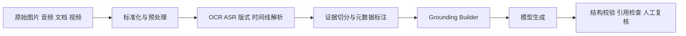

---
kb_id: llm-foundations/multimodal-llm-vision-audio-document-and-video-pipeline
title: 多模态 LLM：图像、音频、文档、视频输入为什么必须拆成对象、链路和证据边界
domain: llm-foundations
component: multimodal
topic: vision-audio-document-video-pipeline-evaluation
difficulty: advanced
status: reviewed
sidebar_position: 14
version_scope: OpenAI vision docs, CLIP paper, OpenAI evaluation best practices, and OpenAI safety best practices as verified on 2026-04-27
last_verified_at: '2026-04-27'
source_ids:
  - openai-images-vision-docs
  - clip-paper
  - openai-evaluation-best-practices
  - openai-safety-best-practices
claim_ids:
  - llm-foundation-claim-0027
  - llm-foundation-claim-0024
  - llm-foundation-claim-0026
tags:
  - multimodal
  - vision
  - audio
  - video
  - document-ai
---
## 多模态系统最容易被讲浅的地方，是把它说成“模型能看图、能听音”
一旦进入真实工程，多模态从来不是一个“多喂一张图”这么简单的能力开关。真正复杂的部分在于：原始信号如何被采集和清洗、图像或音频中的结构化信息怎样进入上下文、哪些证据能被追溯、哪些高风险输出必须降级给人工。只要这些问题没拆开，多模态系统就很容易在演示里显得惊艳，在生产里却变得不可解释。

## 解决什么问题
多模态系统解决的核心问题，是让模型不只依赖用户转述的文本，而能直接从图像、语音、扫描件、表格、截图和视频时间线里获取证据。它常见于四类任务：

1. 视觉理解：读图表、读截图、看票据、看界面。
2. 文档理解：处理 PDF、扫描件、合同、表格和版式复杂文档。
3. 语音理解：语音识别、会议摘要、质检和检索。
4. 视频理解：关键帧、字幕、音轨和时间线联合分析。

### 为什么文本模型加 OCR 文本还不够
因为很多信息并不只存在于纯文本里。版式、表格结构、视觉指向、镜头切换、说话人轮次、屏幕区域位置，都会影响理解结果。多模态系统的价值，在于保留这些原始结构，而不是在预处理阶段把它们全都抹平。

## 核心对象
| 对象 | 作用 | 失控后最常见的后果 |
| --- | --- | --- |
| Input Adapter | 接入图片、音频、文档或视频 | 输入损坏、方向错误、分辨率不足 |
| OCR / ASR | 把图像文字或语音转成可处理文本 | 错字、漏字、时间戳错位 |
| Layout / Timeline Parser | 保留页面结构、表格关系、时间顺序 | 表格行列关系丢失、镜头顺序混乱 |
| Evidence Chunker | 把多模态证据切成可检索或可拼装单元 | 证据切碎或上下文过大 |
| Grounding Builder | 决定哪些证据真正进入模型上下文 | 模型看到的不是最关键材料 |
| Generator | 基于多模态上下文组织回答 | 语言流畅但事实错 |
| Validator | 检查结构、引用、敏感输出和不确定性 | 错误结果直接外发 |
| Human Review Gate | 在高风险任务中做人机协同兜底 | 关键错误无人拦截 |

### 多模态对象为什么比纯文本系统更多
因为纯文本系统很多问题都可以退化成“文本是否正确”。而多模态系统的证据链更长，任何一层都可能引入误差：图片模糊、OCR 错、版式解析错、关键帧漏抽、ASR 时间戳偏移。对象不拆开，就没有办法做真正的责任定位。

## 执行链路
一个典型的多模态理解链路，通常不是一次模型调用，而是多阶段流水线：

1. 原始信号被采集并标准化，例如旋转纠正、采样率调整、关键帧抽取。
2. 图像和文档经过 OCR、版式解析、表格解析，音频和视频经过 ASR 与时间轴对齐。
3. 中间证据被切分、标注来源、页码或时间戳。
4. Grounding Builder 选择最关键的证据进入 prompt 或检索链路。
5. Generator 输出答案、摘要、标签或结构化字段。
6. Validator 根据规则校验输出，必要时交给人工复核。



## 一致性与容错
多模态系统的错误很少是单点错误，更多是误差逐层累积：

1. OCR 漏了一个关键数字，后面的推理就会整体偏掉。
2. ASR 把否定词识别错，摘要可能彻底反义。
3. 表格列对齐丢失后，数值和指标会被错误配对。
4. 视频只抽了一帧，模型会把局部画面误认为全局结论。

### 为什么不确定性处理很重要
多模态输入常常天然不完整。模糊、遮挡、噪声、低清晰度、页面截断、音频串扰，都会让“看不清”成为常态。如果系统没有显式的不确定性策略，模型很容易把看不清的内容也说得很确定，进而把感知误差包装成推理结论。

## 性能模型
多模态系统的性能预算不能只看模型推理时间，还要看前面的感知链路：

1. 图片或文档预处理会消耗 CPU 和 IO。
2. OCR / ASR 往往是额外的延迟来源。
3. 视频任务的关键帧数、字幕长度和时间线窗口决定上下文体积。
4. 多模态证据进入 prompt 后，还会继续消耗 token budget。

### 多模态为什么经常比文本系统更贵
因为它往往叠加了两套成本：感知成本和生成成本。前者负责把原始信号转成可用证据，后者负责基于这些证据组织答案。感知阶段如果没有做筛选和压缩，后面的模型阶段就会被大量噪声和 token 浪费拖慢。

## 生产排障
多模态系统出问题时，最有效的排障顺序通常是：

1. 先确认感知层是否已经把原始信息提对了。
2. 再看版式或时间线结构有没有保留下来。
3. 再看进入模型的上下文是否包含关键证据。
4. 最后才判断生成模型是否在已有证据上跑偏。

### 常见故障与第一责任层
1. 数字总是读错：先查 OCR 和图片清晰度。
2. 视频摘要遗漏关键事件：先查关键帧抽取和时间线窗口。
3. 文档问答答非所问：先查版式解析和 evidence chunk。
4. 模型总是过度自信：先查 validator 和不确定性策略。

## 样例
一个适合保留证据定位能力的多模态 chunk，可以长成下面这样：

```json
{
  "source_type": "pdf_page",
  "doc_id": "contract-2026-02",
  "page": 7,
  "bbox": [112, 268, 914, 533],
  "text": "付款条件：发票签收后 30 天内付款",
  "confidence": 0.92
}
```

它比只保留一段纯文本更有价值，因为它还能告诉系统答案来自哪一页、哪一块区域、识别置信度是多少。

```yaml
multimodal_latency_budget:
  image_preprocess_ms: 40
  ocr_ms: 180
  retrieval_ms: 60
  generation_ms: 700
  validation_ms: 50
```

这个预算样例说明：多模态系统的瓶颈不一定在最终生成，有时 OCR 或关键帧处理才是主要延迟来源。

## 相邻技术边界
多模态系统不是 OCR 工具、不是纯 ASR 服务、也不是任意长视频都能一次性看完的“万能模型”。OCR 和 ASR 负责感知层，多模态 LLM 负责把这些感知结果与任务问题、上下文和生成目标结合起来。它也不替代 RAG、权限治理和人工复核，尤其在高风险场景下，多模态只是把输入种类变丰富，不会自动让系统更可靠。

## 本页结论
多模态 LLM 的本质不是“能看图、能听音”，而是把图像、音频、文档和视频输入拆成可治理的对象链路，再用 grounding、校验和评估把答案约束回证据。只有这样，多模态能力才会从演示功能变成可维护系统。
