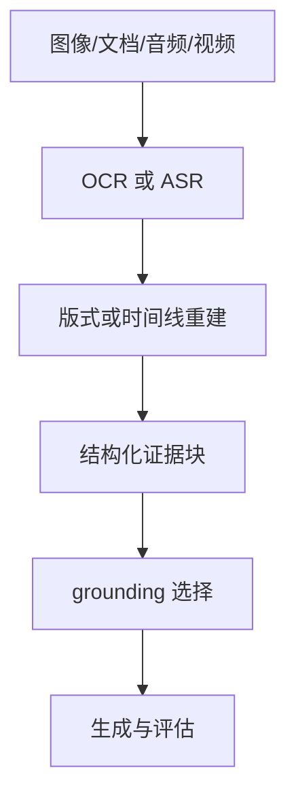

---
kb_id: llm-foundations/multimodal-ocr-asr-layout-timeline-grounding-and-evaluation
title: 多模态深水区：OCR、ASR、版式、时间线与 grounding 为什么决定系统可靠性
domain: llm-foundations
component: multimodal
topic: multimodal-ocr-asr-layout-timeline-grounding
difficulty: advanced
status: reviewed
sidebar_position: 15
version_scope: OpenAI vision docs, CLIP paper, OpenAI evaluation best practices, and OpenAI safety best practices as verified on 2026-04-27
last_verified_at: '2026-04-27'
source_ids:
  - openai-images-vision-docs
  - clip-paper
  - openai-evaluation-best-practices
  - openai-safety-best-practices
claim_ids:
  - llm-foundation-claim-0027
  - llm-foundation-claim-0024
  - llm-foundation-claim-0026
tags:
  - multimodal
  - ocr
  - asr
  - grounding
  - evaluation
---
## 多模态系统真正拉开差距的地方，不在“是否能接图片”，而在中间证据能不能被保真地传下去
很多团队在多模态项目里最先打通的是上传图片、上传 PDF、上传会议录音，但最晚被认真设计的却往往是中间证据层。问题也通常出在这里：OCR 文本看起来差不多，但表格结构已经丢了；ASR 文本能读，但说话人切换和时间戳已经错了；视频抽了关键帧，但镜头之间的因果链没保住。最终模型并不是不会回答，而是看到的证据已经变形。

## 解决什么问题
这一页关注多模态系统里最容易被低估的四个中间层：

1. OCR：图像和扫描文档里的文本如何被可靠抽取。
2. ASR：语音和视频音轨如何变成带时间信息的文本。
3. Layout / Timeline：页面结构和时间结构如何保留下来。
4. Grounding：这些中间证据如何真正进入模型上下文和评估闭环。

### 为什么不能只保留最终转写文本
因为一旦只保留纯文本，你通常会同时失去：

1. 页面区域位置。
2. 表格单元格关系。
3. 视频事件发生时间。
4. 说话人轮次。
5. 图像局部与全局的对应关系。

失去这些结构后，模型即使语言能力再强，也只能在不完整证据上推理。

## 核心对象
| 对象 | 负责什么 | 观察重点 |
| --- | --- | --- |
| OCR Span | 抽取到的文字片段 | 识别置信度、坐标、阅读顺序 |
| ASR Segment | 音频转写片段 | 起止时间、说话人、漏词和串音 |
| Layout Block | 标题、段落、表格、图注等版式块 | 层级和相邻关系是否正确 |
| Timeline Window | 视频中的时间段证据 | 是否覆盖完整事件链 |
| Grounded Evidence | 真正进入上下文的证据块 | 是否保留来源和结构标签 |
| Eval Case | 覆盖视觉事实、转写、时间线和拒答场景 | 是否能复现实验失败 |

## 执行链路
把中间层做对，链路通常要显式保留结构信息，而不是只做一次文本提取：

1. 先针对模态做局部处理，例如图像 OCR、音轨 ASR、文档版式解析。
2. 再把局部结果按页面、表格、说话人或时间顺序重新组装。
3. 然后把结构化证据切成适合检索或 prompt 的块。
4. 最后 grounding 层决定哪些证据真正被模型消费。



## 一致性与容错
多模态系统中最危险的错误，往往是“中间层看起来像对的”。比如 OCR 只错了一位小数点、ASR 只漏了一个“不”、表格列错位了一格、关键帧漏了一次切换，最终输出却会完全跑偏。为了降低这种累积误差，需要明确几条容错原则：

1. 感知层要保留置信度，不能把低置信度文本伪装成确定事实。
2. Grounding 层要优先保留结构化证据，而不是只保留一段长文本。
3. 高风险场景要允许“不确定”或“需要人工复核”的出口。
4. 评估集要单独覆盖 OCR、ASR、版式和时间线错误，而不是只看最终回答是否顺眼。

## 性能模型
中间证据层也直接影响性能：

1. OCR 和 ASR 的粒度越细，后续处理成本越高。
2. 如果版式解析过度保留细节，token 预算会被中间结构吃掉。
3. 视频时间线切得过密，会让关键帧和字幕证据膨胀。
4. Grounding 选择不收敛，生成阶段就会被上下文噪声压垮。

### 为什么“先抽纯文本再说”经常是伪优化
它的短期收益是实现快，但长期代价很大：一旦系统需要引用页码、定位截图区域、解释表格关系、回看视频片段，你就必须把被抹平的结构重新找回来，往往比一开始保留结构更贵。

## 生产排障
如果多模态结果不稳定，优先从中间层定位，而不是先怀疑最终模型：

1. 文档问答不准时，看 OCR span 和 layout block。
2. 会议摘要说错人时，看 ASR segment 和说话人切分。
3. 视频问答缺事件时，看 timeline window 和关键帧覆盖率。
4. 回答有出处但出处不对时，看 grounded evidence 的来源映射。

### 一份适合排障的证据记录
```json
{
  "segment_type": "asr",
  "speaker": "spk_02",
  "start_ms": 184200,
  "end_ms": 191040,
  "text": "我们暂时不同意这个发布日期",
  "confidence": 0.81
}
```

```yaml
multimodal_eval_matrix:
  visual_fact:
    - chart_value_correct
    - small_text_readable
  audio_fact:
    - negation_preserved
    - speaker_turn_correct
  document_fact:
    - table_cell_alignment
    - page_reference_correct
  video_fact:
    - event_order_correct
    - timestamp_reference_correct
```

这个评估矩阵的意义是把问题拆回模态和中间层，而不是只做一个笼统“多模态准确率”。

## 相邻技术边界
这一页讲的是中间证据层，不是模型架构本身。CLIP 一类模型解释的是跨模态表征，OCR / ASR 解释的是感知抽取，grounding 解释的是证据如何被使用，评估解释的是系统是否真的可靠。把这些层混成“一个多模态模型”会让团队在定位问题时失去抓手。

## 本页结论
多模态系统的深水区在中间证据层。OCR、ASR、版式、时间线和 grounding 做不好，最终模型看到的就不是原始事实，而是已经变形的代理信号。真正可靠的多模态系统，必须把这些中间层设计成可观测、可评估、可复核的对象。
