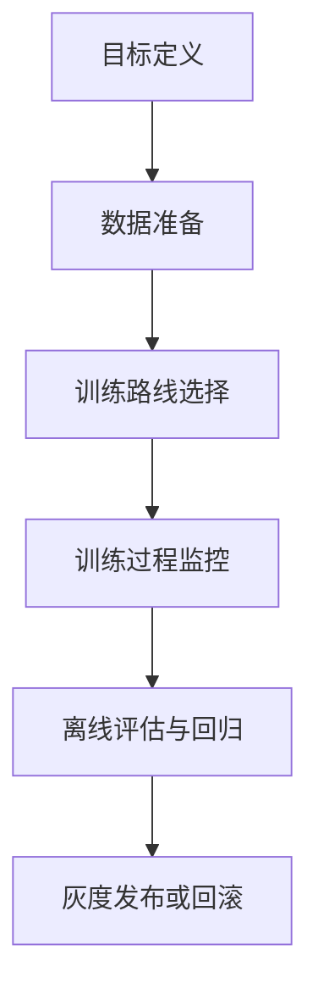

## 一句话结论

后训练深挖：SFT、DPO、Online RL、评估和回归风险需要从对象、链路、边界和证据四个角度理解。

## 实践资料 资料怎么合并

`post-training-of-llms` 的价值是把 DeepLearning.AI 后训练课程整理成中文路径，覆盖 SFT、DPO、Online RL 和实践代码。
在知识系统里，它应该和 InstructGPT、DPO、TRL 等来源合并，而不是单独变成课程笔记。

## 后训练的三层目标

后训练通常服务三层目标：

1. 指令遵循：模型是否理解任务格式
2. 偏好对齐：模型输出是否更符合人类或业务偏好
3. 运行期优化：模型是否能围绕反馈持续改进行为

SFT 更偏第一层。
DPO 和 RLHF 更偏第二层。
Online RL 关注模型与环境或反馈交互后的优化，但工程风险也更高。

## 执行链路
把后训练讲深，必须把“训练前、中、后”的链路拆开：

1. 训练前：定义目标任务、准备监督数据或偏好数据、建立评估集。
2. 训练中：选择 SFT、DPO、RLHF 或 Online RL 路线，并监控训练稳定性。
3. 训练后：跑目标任务评估、拒答评估、回归测试和线上灰度验证。
4. 发布阶段：保留可回滚版本，不把一次训练视为最终答案。



### 训练前后对比样例
```yaml
eval_snapshot:
  instruction_following: +6.2
  preference_win_rate: +8.0
  factuality: -1.5
  refusal_safety: -3.4
  release_decision: investigate_regression
```

这个样例表达的是：后训练成功与否，取决于多维评估结果，而不是某一个局部指标。

## SFT 的核心

SFT 用高质量监督数据训练模型，让模型学会任务格式、回答风格和基本指令遵循。

关键问题：

1. 数据是否覆盖目标任务
2. 答案质量是否稳定
3. 格式是否一致
4. 是否混入错误示例
5. 是否造成灾难性遗忘或能力退化

SFT 不等于补充最新事实知识，也不保证安全。

## DPO 的核心

DPO 使用 preference pairs，也就是 chosen/rejected 形式的数据，让模型更偏向被选择的回答。
它相比传统 RLHF 的 reward model 加 RL 链路更直接，但仍依赖偏好数据质量。

技术复盘要讲清：

1. DPO 不是无监督
2. DPO 不是不需要高质量数据
3. DPO 优化的是偏好，不是事实数据库
4. DPO 后仍需要评估和安全控制

## Online RL 的风险

Online RL 或在线反馈优化听起来很强，但生产风险更高。

风险包括：

1. 奖励信号设计错误
2. reward hacking
3. 短期指标和长期质量冲突
4. 在线分布变化
5. 用户反馈噪声
6. 回滚困难
7. 安全边界被优化过程绕过

所以技术复盘中不能只说“在线强化学习更高级”。要说它需要稳定奖励、严格评估、灰度、监控和回滚。

## 后训练评估

后训练前后至少要比较：

1. 指令遵循是否提升
2. 格式稳定性是否提升
3. 偏好胜率是否提升
4. 事实正确性是否退化
5. 安全拒答是否退化
6. 原有能力是否退化
7. 成本和延迟是否变化

一个模型在目标任务上变好，可能在别的能力上变差。
这就是为什么后训练要做回归测试。

## 一致性与容错
Online RL 和偏好优化最容易带来的问题，不是训练报错，而是行为漂移：

1. 线上反馈噪声让模型朝错误方向优化。
2. 奖励函数和真实业务目标不完全一致，导致 reward hacking。
3. 某个局部任务胜率上升，但整体产品体验下降。
4. 训练后版本没有灰度和回滚，线上风险难以控制。

### 为什么 Online RL 尤其需要回滚设计
因为它引入了运行时反馈与分布变化。相比离线后训练，它更容易在真实用户场景中放大错误奖励。如果没有版本冻结、灰度和回滚，问题会直接扩散到线上。

## 性能模型
后训练深水区的成本主要体现在：

1. 偏好数据收集与标注成本。
2. 奖励建模或偏好优化的训练成本。
3. 训练后全量回归评估成本。
4. 灰度发布与线上观测成本。

### 为什么后训练工程常常慢在训练外
因为真正难的部分，往往不是跑一轮优化，而是准备高质量数据、定义可靠评估、定位回归和安全发布。很多团队不是缺训练脚本，而是缺一条完整的发布治理链。

## 生产排障
如果后训练后的模型在线上出现奇怪行为，排障应按下面顺序来：

1. 先判断问题来自数据分布、奖励设计还是评估盲区。
2. 再看是否只在特定任务、特定用户群或特定 prompt 模式下出现。
3. 再检查训练后版本与灰度前版本的关键指标差异。
4. 必要时快速回滚，再补数据和评估，而不是继续硬调。

### 发布治理样例
```json
{
  "release_id": "post-train-2026-05-14",
  "canary_traffic": "5%",
  "observed_issue": "unsafe_refusal_regression",
  "rollback_triggered": true
}
```

这个样例说明，后训练如果没有灰度与回滚，回归风险就会直接变成生产事故。

## 机制解读

后训练要按 SFT、偏好优化、Online RL、评估和回归风险来讲。SFT 用高质量指令数据让模型学习任务格式和指令遵循；DPO 使用 chosen/rejected 偏好对直接优化模型偏好，但仍依赖数据质量；RLHF 通过 reward model 和策略优化对齐偏好；Online RL 进一步引入运行期反馈，但奖励设计、reward hacking、分布变化和回滚风险更高。后训练改善的是行为和偏好，不等于事实正确、最新知识或系统安全。生产里必须用评估集比较改动前后表现，检查目标能力提升、原有能力退化、安全拒答、格式稳定和业务风险。

## 易混边界

1. 把后训练等同于普通微调
2. 认为 DPO 不依赖数据质量
3. 认为 RLHF 是补知识
4. 认为 Online RL 越多越好
5. 不做退化评估和回归
6. 用后训练替代 RAG 和安全治理

## 进一步分析准备

1. SFT 和 DPO 的数据形式有什么区别？
2. 为什么偏好优化不等于事实正确？
3. Online RL 最大工程风险是什么？
4. 后训练后如何判断原有能力有没有退化？
