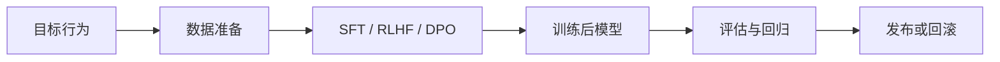

## 一句话结论

Post-training / SFT / RLHF / DPO：后训练解决什么，不解决什么需要从对象、链路、边界和证据四个角度理解。

## 为什么预训练后还需要后训练

预训练模型学习的是大规模文本分布。
它能学到语言、知识和模式，但不天然等于：

1. 会遵循用户指令
2. 会拒绝不该回答的问题
3. 会按固定格式输出
4. 会理解业务安全边界
5. 会稳定满足人类偏好

后训练就是在预训练底座上继续调整行为。

## 核心对象
| 对象 | 作用 | 典型风险 |
| --- | --- | --- |
| Instruction Dataset | 提供监督信号，让模型学会任务格式与回答风格 | 数据质量差会直接学坏输出模式 |
| Preference Pairs | 表达 chosen / rejected 的偏好关系 | 覆盖不足会让偏好优化失真 |
| Reward Model | 在 RLHF 路线中近似人类偏好 | 奖励错会导致 reward hacking |
| Policy Model | 被后训练的主体模型 | 可能获得目标能力，也可能退化原有能力 |
| Eval Set | 检查能力提升、拒答行为和回归风险 | 没有评估就无法判断改动价值 |

### 为什么这些对象必须拆开讲
因为“后训练”不是一个统一黑箱。SFT、RLHF、DPO 的差异，本质上就在于它们依赖的数据对象、优化对象和评估风险不同。如果把这些对象混成一句“继续微调模型”，就解释不了为什么同样叫后训练，工程难点却差别很大。

## 执行链路
从工程视角看，后训练至少要有一条可解释的数据与评估链：

1. 明确目标行为，是提升指令遵循、偏好对齐还是拒答边界。
2. 准备监督数据或偏好数据，并做清洗与筛选。
3. 选择 SFT、RLHF 或 DPO 这样的优化路径。
4. 对训练前后模型跑评估集，比较目标能力与退化风险。
5. 根据结果决定是否发布、灰度或回滚。



### 数据结构样例
```json
{
  "prompt": "解释 Kafka 为什么同组内一个分区只给一个消费者",
  "chosen": "因为分区是组内并行消费与顺序保证的基本分配单元...",
  "rejected": "因为 Kafka 不支持多线程消费同一个分区..."
}
```

这个样例说明，DPO 或偏好优化依赖的不是普通问答对，而是明确的偏好比较对象。

## SFT 解决什么

SFT 是 supervised fine-tuning，通常用高质量指令数据训练模型。

它的作用是：

1. 学习指令格式
2. 学习问答、改写、总结、代码等任务形式
3. 提升模型对用户意图的跟随能力
4. 让模型输出更像目标产品需要的风格

但 SFT 的边界也很明显：

1. 数据覆盖不到的场景可能仍然不稳定
2. 错误示例会被模型学习
3. 它不自动建立偏好排序能力

## RLHF 解决什么

InstructGPT 风格的 RLHF 通常包含：

1. 先做 SFT
2. 收集人类偏好比较
3. 训练 reward model
4. 用强化学习优化策略

RLHF 的目标不是让模型记住更多事实，而是让模型输出更符合人类偏好和任务意图。

它的工程难点在于：

1. 偏好数据质量
2. reward model 是否可靠
3. 优化过程是否稳定
4. 是否出现 reward hacking
5. 是否损失某些原有能力

## DPO 解决什么

DPO 也是基于偏好数据进行优化，但它不按传统 RLHF 那样显式训练 reward model 再跑强化学习，而是用更直接的偏好优化目标。

技术复盘中可以这样讲：

1. RLHF 是 reward model + policy optimization 路线
2. DPO 是更直接利用 chosen/rejected preference pairs 优化模型的路线
3. 两者都依赖偏好数据质量
4. 两者都不能替代事实评估和安全治理

## 后训练不解决什么

后训练很重要，但不要神化。

它不能单独保证：

1. 最新知识正确
2. 引用一定真实
3. 工具调用一定安全
4. 业务规则一定合规
5. 没有 prompt injection 风险
6. 所有领域都达到专家水平

生产系统仍然需要：

1. RAG
2. Tool permission
3. Guardrails
4. Human-in-the-loop
5. Eval
6. Observability

## 一致性与容错
后训练最容易被忽略的，不是目标能力能不能升上去，而是改完之后系统是否仍然一致：

1. 目标任务变好，但原有任务退化。
2. 指令更听话了，但安全拒答被削弱。
3. 偏好更贴近标注者，但事实正确性下降。
4. 离线分数变好，线上分布却不一致。

### 为什么“训练成功”不等于“可以发布”
因为训练只说明优化过程跑完了，不说明模型整体表现变好了。真正的发布判断必须同时看目标能力、原有能力、拒答边界、业务风险和线上回归。

## 性能模型
后训练的成本不能只看训练轮数，还要看数据和发布治理成本：

1. SFT 通常工程链相对简单，但对数据质量要求高。
2. RLHF 需要额外奖励建模和策略优化链路，复杂度更高。
3. DPO 省掉了传统 RLHF 的部分链路，但仍然高度依赖偏好数据质量。
4. 每次后训练之后的评估、回归和灰度验证，往往和训练本身同样关键。

### 为什么偏好优化经常比想象中更贵
因为真正贵的不是梯度更新本身，而是构建高质量偏好数据、保证标注一致性、做回归评估和控制发布风险。

## 生产排障
如果后训练后模型表现异常，建议优先这样查：

1. 先看问题出在数据质量、优化路径还是评估解释。
2. 再看目标能力提升是否伴随明显退化。
3. 再看是否出现 reward hacking、过拟合偏好或拒答边界漂移。
4. 最后才决定是否需要回滚、继续收集数据或换优化路线。

### 回归判断样例
```yaml
post_training_release_check:
  target_task_score: up
  safety_refusal_score: down
  factuality_score: flat
  release_decision: hold_and_rework
```

这个样例体现的是：后训练后的判断，必须是多维度的，而不是只看某一个胜率指标。

## 机制解读

后训练是在预训练模型之上调整行为，让模型更会遵循指令、更符合人类偏好、更适合应用。SFT 用高质量指令数据教模型任务格式和回答风格；RLHF 通常先做 SFT，再用人类偏好比较训练 reward model，并通过策略优化让输出更符合偏好；DPO 则更直接使用 chosen/rejected 偏好对优化模型，避免传统 RLHF 中显式 reward model 加强化学习的完整链路。后训练能改善指令遵循和偏好对齐，但不能保证事实正确、工具安全、业务合规和最新知识，生产系统仍需要 RAG、权限、guardrails、人工介入和评估。

## 易混边界

1. 认为预训练模型天然会听指令
2. 把 SFT、RLHF、DPO 混成一个概念
3. 认为 RLHF 让模型事实更可靠
4. 认为 DPO 不需要高质量偏好数据
5. 用后训练替代应用层安全治理
