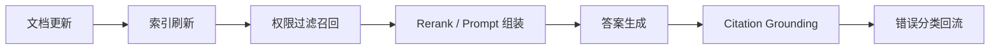

## 真实 RAG 项目里最难的，往往不是第一版搭起来，而是第二个月它还是否可信
很多 RAG 系统初版都能跑通，真正困难的是长期治理：文档每天更新，权限不断变化，引用要求越来越严格，线上失败样本越来越复杂。到了这个阶段，系统质量已经不再由 embedding 模型单独决定，而是由新鲜度、权限、引用支撑和排障能力共同决定。

## 解决什么问题
这一页主要补 RAG 的治理与排障面：

1. 为什么索引新鲜度直接影响答案可信度。
2. 为什么权限过滤必须进入检索链路，而不是只在答案层提醒。
3. 为什么“有引用”不等于“被引用内容真的支持答案”。
4. 为什么 RAG 排障必须能拆到 chunk、retrieval、rerank、Prompt 和 generation。
5. 为什么治理层通常比第一版检索算法更决定长期效果。

## 核心对象
| 对象 | 作用 | 风险 |
| --- | --- | --- |
| Freshness Policy | 决定文档更新何时反映到索引 | 旧政策继续回答新问题 |
| Permission Filter | 决定候选证据是否对当前用户可见 | 越权检索和越权回答 |
| Citation Grounding | 检查引用是否真实支撑结论 | 形式上有引用，实质上无支撑 |
| Failure Taxonomy | 把错误分类到具体环节 | 问题反复出现却总在猜 |

### 为什么权限必须在检索层执行
因为一旦越权内容被召回进入上下文，即使模型最后没有明确原文照抄，也可能被污染出不该知道的信息。权限边界必须尽量前移，而不是等生成后再补救。

## 执行链路
一个治理更完整的 RAG 系统通常会这样工作：

1. 文档更新进入 ingestion 队列。
2. 索引刷新策略决定何时重建或增量更新。
3. query 到来时先按租户、角色和权限过滤候选。
4. 候选进入 rerank 和 Prompt 组装。
5. 生成后执行 citation grounding 检查。
6. 错误样本被分类回流。



### 为什么 citation grounding 不能省
因为生成模型会把证据重新组织成自然语言。即使它带了引用，也可能把引用片段和答案结论错配。只有做支撑检查，才能判断“这条引用是否真的证明了这句话”。

## 一致性与容错
治理视角下的 RAG 常见故障包括：

1. 索引延迟更新，系统继续回答过期政策。
2. 同一文档不同版本并存，检索把旧版排在新版前面。
3. 权限过滤只做前端隐藏，后端检索仍可越权召回。
4. 引用编号存在，但引用正文不支持关键结论。

### 为什么 RAG 问题必须“样本化”
因为同一类故障往往会反复出现。只有把过期索引、权限越界、引用错配等问题沉淀成带标签的失败样本，后续回归和治理才有抓手。

## 性能模型
RAG 治理也有成本：

1. 更高频的索引刷新增加计算和存储成本。
2. 权限过滤增加检索复杂度。
3. grounding 检查增加尾部延迟。
4. 失败样本治理增加标注成本。

### 为什么治理不能被视为“额外负担”
因为没有治理时，系统会把成本转移成过时答案、越权暴露和业务不信任。这些代价通常比多花一点索引和评估成本更高。

## 生产排障
当用户说“昨天还能答，今天答错了”时，RAG 排障应该先问：

1. 文档最近是否更新，索引是否已同步。
2. 当前用户权限是否发生变化。
3. 召回的是否是旧版、错版或越权内容。
4. 引用是否真实支撑结论，还是只是形式上挂了编号。

### 适合长期保留的治理证据
1. 文档版本与索引时间戳。
2. 权限过滤命中情况。
3. 引用支撑结果。
4. 失败样本分类。

## 样例
下面这个索引状态片段，能帮助判断“新鲜度问题”是否存在：

```yaml
index_status:
  doc_id: policy_2025_refund
  source_updated_at: 2026-05-13T09:10:00
  indexed_at: 2026-05-13T09:32:00
  freshness_sla_minutes: 30
```

而这个错误分类片段，则适合回归治理：

```json
{
  "case_id": "rag_fail_021",
  "failure_type": "citation_not_supported",
  "root_cause": "chunk_relevant_but_answer_overclaims"
}
```

## 相邻技术边界
这一页讨论的是 RAG 治理和故障定位，不等于 embedding 算法教程，也不等于文档管理系统本身。它关注的是：RAG 系统如何在持续变化的知识环境中保持可信与可控。

## 本页结论
RAG 的长期价值，不在第一天能不能答，而在第很多天之后它是否仍然用最新、授权、可支撑的证据回答问题。新鲜度、权限、引用支撑和故障定位，是 RAG 从 demo 走向系统的关键关口。
