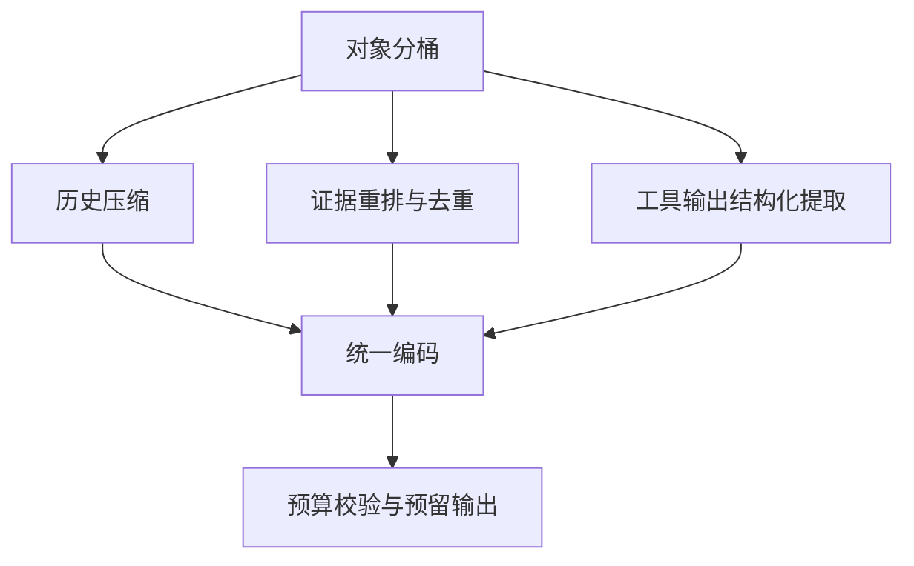

---
kb_id: llm-foundations/tokenizer-packing-truncation-chat-history-and-retrieval-budgeting
title: Token Budget 实战：聊天历史、RAG 证据、工具输出应该如何打包、截断和压缩
domain: llm-foundations
component: tokenizer
topic: tokenizer-packing-truncation-history-retrieval-budgeting
difficulty: advanced
status: reviewed
sidebar_position: 4
version_scope: Hugging Face tokenizer course, OpenAI token help article, and OpenAI latency optimization guide as verified on 2026-04-26 to 2026-04-27
last_verified_at: '2026-04-27'
source_ids:
  - huggingface-tokenizers-course
  - openai-tokenizer-help
  - openai-latency-optimization-guide
claim_ids:
  - llm-foundation-claim-0004
  - llm-foundation-claim-0005
tags:
  - tokenizer
  - truncation
  - history-packing
  - rag
  - agent
---
## 真正难的不是知道 token 会变贵，而是知道该先裁谁、怎么裁、裁完为什么还能保持任务质量
在实际系统里，预算超限几乎是常态，不是例外。尤其在多轮聊天、RAG、Agent 工具链场景下，历史、证据、工具输出和回答空间会一起竞争。此时最糟糕的做法就是“从后往前硬截断”，因为被裁掉的往往正是任务最关键的那部分上下文。

## 解决什么问题
这一页专门回答三个工程问题：

1. 历史、检索证据和工具输出的预算应该怎么分层。
2. 截断和压缩时，为什么要保对象边界，而不是按纯文本长度裁剪。
3. 如何通过打包策略区分“高价值上下文”和“低价值上下文”。

## 核心对象
| 对象 | 典型内容 | 更适合的处理方式 |
| --- | --- | --- |
| System / Developer Prompt | 规则、角色、输出格式、禁令 | 尽量稳定，减少重复 |
| Conversation History | 用户历史问题和系统历史回答 | 摘要化、窗口化保留 |
| Retrieval Evidence | 文档片段、标题、来源、页码 | 去重、重排、压缩，但保留出处 |
| Tool Output | 搜索结果、表格、JSON、日志 | 结构化提取，避免整段直塞 |
| Reserved Completion | 预留给最终回答的空间 | 不可被输入随意侵占 |

## 执行链路
预算分配通常不应该发生在文本拼接之后，而应该发生在对象层：

1. 先按对象划分输入桶。
2. 计算每个桶的目标上限。
3. 对各桶分别执行压缩、摘要、重排或截断策略。
4. 最后再统一编码和校验是否超限。



## 一致性与容错
最常见的预算失控问题，不是 token 真的不够，而是系统没有优先级：

1. 历史长但没有摘要，旧对话挤掉当前证据。
2. 检索片段多但没有重排，噪声挤掉高价值 chunk。
3. 工具返回长日志，直接占满上下文。
4. 没有预留 completion，模型中途停止。

### 为什么对象边界比字符边界更重要
因为任务语义通常沿对象边界组织。一个检索 chunk 被截到一半后，可能失去标题和来源；一个 JSON 工具输出被截断后，可能连字段名都不完整；一个历史总结如果保留了错误上下文，后面的回答会沿着旧偏差继续走。按对象处理，至少还能保持结构完整。

## 性能模型
好的打包策略本质上是在做“高价值 token 优先”：

1. 当前任务最相关的检索证据优先。
2. 必要规则和格式约束优先。
3. 摘要后的近期历史优先。
4. 冗长工具日志和重复片段最后进入上下文，甚至不进入。

### 为什么很多 Agent 会被工具输出拖死
因为工具结果往往是结构化大文本，比如网页、日志、SQL 查询结果、JSON 数组。如果不先提取任务相关字段，模型会在低价值 token 上消耗上下文和延迟。

## 生产排障
当系统出现“输出突然变短”“RAG 召回看起来没问题但答案变差”“多轮对话越聊越偏”时，可以优先查预算策略：

1. completion 预留是否被侵占。
2. 最近一次检索和工具结果是否明显膨胀。
3. 历史是否还在按固定窗口保留，而不是按任务相关度保留。
4. 同一个对象是否出现重复内容进入 prompt。

## 样例
一个对象级压缩策略可以写成这样：

```python
def pack_request(system_prompt, history, retrieval_docs, tool_results):
    history_summary = summarize_history(history, max_tokens=1200)
    selected_docs = rerank_and_trim(retrieval_docs, max_tokens=2600)
    tool_digest = extract_relevant_fields(tool_results, max_tokens=900)
    return {
        "system": system_prompt,
        "history": history_summary,
        "retrieval": selected_docs,
        "tool_output": tool_digest,
        "reserved_completion_tokens": 1000,
    }
```

```yaml
packing_policy:
  keep_recent_turns: 4
  summarize_older_history: true
  max_retrieval_chunks: 5
  keep_source_metadata: true
  strip_low_value_tool_logs: true
  reserve_completion_ratio: 0.18
```

这两个样例表达的是同一个原则：不要让所有对象平等竞争上下文，而要让系统显式决定谁优先保留。

## 相邻技术边界
这页讨论的是打包和截断策略，不是 tokenizer 算法本身。BPE、WordPiece、Unigram 解释的是如何切 token；而这里讨论的是 token 已经形成之后，系统如何在对象层组织它们。两者是一前一后、不能混讲的两层。

## 本页结论
Token budget 的真正工程价值，不在于知道“token 很贵”，而在于把系统提示、历史、检索和工具结果拆成对象后做优先级打包。好的上下文不是最长的上下文，而是最会把有限 token 花在关键证据上的上下文。
