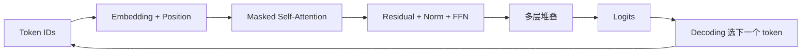

## Transformer 真正改变的，不只是把 RNN 换成了 Attention
很多入门解释会说，Transformer 的核心就是 self-attention，GPT 属于 decoder-only，大模型通过 next-token prediction 生成文本。这些都对，但还停在“知道概念”阶段。更深一层的理解是：Transformer 把序列建模从“沿时间步携带状态”改成了“让每个位置按上下文重新计算表示”；而 decoder-only 则进一步把这种表示约束在“只能看历史 token”的条件下，用于自回归生成。

## 解决什么问题
这一页主要回答六个问题：

1. Transformer 相比 RNN 到底改掉了什么计算组织方式。
2. self-attention 为什么能表达长距离依赖，而不是只是一种更贵的矩阵运算。
3. multi-head attention 为什么不是单纯“多做几遍同样的事”。
4. decoder-only 为什么天然适合生成任务。
5. next-token prediction、上下文构造和最终回答能力之间是什么关系。
6. 为什么结构理解不到位时，后面的推理、长上下文和排障都会讲得很虚。

## 核心对象
| 对象 | 作用 | 如果理解偏了会怎样 |
| --- | --- | --- |
| Token Embedding | 把离散 token 映射成向量 | 误以为模型直接理解字符本身 |
| Positional Signal | 补足序列位置信息 | 不知道顺序信息从哪里来 |
| Query / Key / Value | 决定每个位置如何检索上下文 | 只会背公式，不知道语义角色 |
| Multi-head Attention | 在同一层并行学习不同关系 | 误判为单纯并行加速 |
| Feed Forward Network | 对每个位置做非线性变换 | 把层能力全归因给 attention |
| Residual + Layer Norm | 稳定深层训练与信息传递 | 不知道深层模型为何能训练 |
| Causal Mask | 保证生成时只能看历史 | 不理解 decoder-only 的边界 |
| Logits / Decoding | 把隐藏表示转成下一个 token 分布 | 把“会生成”误解成“天然会推理” |

### 为什么 attention 不能脱离上下文表示来理解
因为它不是独立功能模块，而是决定“当前位置到底该聚合哪些历史信息”的计算规则。每个 token 的表示不是固定值，而是随着上下文重新计算。也正因为如此，prompt 组织方式、序列长度和 mask 设计都会深刻影响模型行为。

## 执行链路
以 decoder-only LLM 为例，一次最基础的生成链路大致是：

1. 文本被 tokenizer 编码成 token IDs。
2. token IDs 进入 embedding，并叠加位置相关信息。
3. 每一层用 Q、K、V 计算注意力，把历史上下文重新聚合到当前位置。
4. 经过残差、归一化和前馈网络，多层堆叠后得到最终隐藏表示。
5. 输出层把最后一个位置的表示投影成词表概率分布。
6. 解码策略从分布中选出下一个 token，再拼回上下文继续下一轮。



### decoder-only 为什么特别适合生成
因为它的 mask 天然规定了当前位置只能依赖左侧历史 token。也就是说，训练目标和推理行为是一致的：训练时学的是“给定历史预测下一个 token”，推理时做的也是“不断追加历史、再预测下一个 token”。这种一致性使它非常适合开放式文本生成。

## 一致性与容错
Transformer 相关问题在工程里经常表现为“模型看起来会说话，但行为并不稳定”，其根因通常落在下面几类边界：

1. `attention_mask` 和 `causal_mask` 设计不当，模型看到的上下文不符合预期。
2. 序列长度增加后，attention 计算成本和数值稳定性同时上升。
3. 训练时的输入打包方式和推理时的 chat template 差异很大。
4. 大家把 next-token prediction 误当成“天然拥有可靠事实能力”，忽略了检索、工具和评估的重要性。

### 为什么 next-token prediction 不是“只会接龙”
因为模型在大规模预训练中学习到的，不只是局部拼字规律，而是语言模式、知识分布、任务格式和上下文相关性。但它依然是在预测 token，而不是在调用一个显式真值数据库，所以事实可靠性、工具执行正确性和安全性仍然要靠更外层系统配合。

## 性能模型
Transformer 的性能直觉至少要包含三层：

1. attention 会随着序列长度增长带来更高的计算与显存开销。
2. 模型层数、隐藏维度和头数决定单次前向的总体代价。
3. decoder-only 推理时，prefill 和逐 token decode 的性能特征不同。

### 为什么长上下文不是免费能力
因为序列一长，attention 的计算和缓存成本都会上来。此时即使模型“理论上支持更长窗口”，实际服务中也会遇到首 token 延迟、显存占用、吞吐下降和批处理效率变化等问题。

## 生产排障
如果模型表现出重复、胡言乱语、输出突然变短或长上下文下质量明显下降，可以优先按下面顺序排查：

1. 输入组织和 token 长度是否已经偏离训练分布。
2. mask、padding 和 chat template 是否一致。
3. 解码参数是否放大了重复或截断问题。
4. 是否把结构问题误当成知识问题，把需要检索的问题交给了纯生成。

### 高价值排障问题
1. 为什么同一个问题在短上下文里正常，在长上下文里开始漏信息。
2. 为什么温度调低后更稳定，但事实错误并没有自动消失。
3. 为什么“模型看上去更会说了”，却不意味着它更可靠。

## 样例
下面这个伪代码展示了单头 attention 的核心计算逻辑，重点不是背公式，而是看清“当前位置如何从全部可见位置中取信息”：

```python
import torch
import math

def attention(q, k, v, mask=None):
    scores = q @ k.transpose(-2, -1) / math.sqrt(q.size(-1))
    if mask is not None:
        scores = scores.masked_fill(mask == 0, float("-inf"))
    weights = torch.softmax(scores, dim=-1)
    return weights @ v
```

而下面这个 causal mask 片段则体现了 decoder-only 的生成边界：右上角被屏蔽，未来 token 不能被当前位置偷看。

```python
seq_len = 6
causal_mask = torch.tril(torch.ones(seq_len, seq_len))
print(causal_mask)
```

## 相邻技术边界
Transformer 是模型结构层，不等于 tokenizer，不等于推理服务，也不等于评估系统。attention 解决的是“在上下文中如何建模关系”，并不自动解决外部知识接入、工具调用正确性和线上可靠性。只有把结构边界和系统边界分开，后续讨论 RAG、Agent、推理加速和安全时才不会混乱。

## 本页结论
Transformer 的核心突破，不只是把 recurrence 去掉，而是让每个位置都能基于可见上下文重新计算表示；decoder-only 则把这种机制变成了适合自回归生成的结构。理解了这条主线，后面的长上下文、KV cache、解码策略和系统边界才会真正落地。
