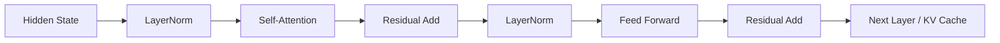

## 真正决定 Transformer 能否做深做大的，往往不是 attention 公式本身
很多介绍把焦点全部放在 Q、K、V 上，仿佛 attention 讲清了，Transformer 就讲清了。可一旦进入训练和落地层面，更决定上限的经常是那些看起来“不起眼”的结构细节：残差怎么传递信息，归一化怎么稳定深层优化，位置编码怎样让模型知道顺序，推理时缓存怎样避免重复计算。忽略这些，Transformer 的理解就只停留在一张结构图。

## 解决什么问题
这一页主要补齐四类常被忽略的问题：

1. 为什么残差连接和归一化是深层 Transformer 可训练的基础设施。
2. 为什么位置编码不是“额外加一个向量”这么简单，而是顺序语义的入口。
3. 为什么结构稳定性问题会直接表现成训练发散、长上下文退化和推理异常。
4. 为什么很多看起来像模型能力不足的问题，其实是层级结构或缓存边界没有处理好。

## 核心对象
| 对象 | 作用 | 典型风险 |
| --- | --- | --- |
| Residual Connection | 保留原始信息并缓解深层优化困难 | 层数加深后梯度和表示传递不稳 |
| Layer Normalization | 稳定训练分布和数值范围 | 训练不稳定、收敛缓慢 |
| Positional Encoding / Position IDs | 给模型提供顺序信息 | 模型知道“内容”，却不知道“先后” |
| Feed Forward Block | 对每个位置做容量扩展和非线性变换 | 把 Transformer 错讲成只有 attention |
| KV Cache | 复用历史 K/V，降低重复计算 | 长上下文下显存和并发瓶颈突出 |

### 为什么这些对象是“系统性对象”
因为它们的影响不会只停在某一层。位置编码决定上下文顺序能否被正确组织，残差和归一化决定几十层甚至上百层结构还能否稳定训练，KV cache 又决定这种结构在推理服务中能否以可接受成本运行。

## 执行链路
一层典型的 decoder block 可以拆成下面的顺序理解：

1. 当前隐藏表示进入归一化层。
2. 经注意力子层计算后，与输入做残差相加。
3. 结果再次进入归一化和前馈网络。
4. 前馈输出再次通过残差回到主干。
5. 在推理阶段，已经计算过的 K/V 可被缓存复用。



### 为什么位置编码要在这条链路前面进入
因为 attention 本身只处理向量之间的相关性。如果没有顺序信息，模型很难区分“先说结论再给原因”和“先给原因再说结论”，更难稳定处理列表、代码、表格或长对话中的相对位置。

## 一致性与容错
这一层经常出现的故障，不一定是代码报错，而是训练和推理质量异常：

1. 位置 ID 处理不一致，导致续写阶段上下文错位。
2. 长上下文下 KV cache 管理错误，历史状态被重复或遗漏。
3. 结构很深但优化策略不稳，loss 下降异常慢或直接震荡。
4. 把 residual / normalization 视为“实现细节”，结果对训练异常毫无解释力。

### 为什么结构稳定性问题经常被误判成数据问题
因为它在表面上也会呈现为 loss 不收敛、输出重复、生成质量差。但如果数据样本和 tokenizer 都正常，仍然出现全局不稳，就应该回到层结构、位置处理和缓存逻辑上查证据。

## 性能模型
结构细节同样会影响推理性能：

1. 更深层数和更大隐藏维度增加前向成本。
2. 更长上下文让位置处理和 attention 开销同步上升。
3. KV cache 能减少重复计算，但会带来额外显存占用。
4. 服务并发上来后，缓存的管理方式会直接影响吞吐。

### 为什么 KV cache 既是优化，也是约束
因为它明显降低了解码阶段的重复 attention 计算，但缓存本身要占内存。上下文越长、并发越高，缓存压力越大，所以它不是“白送性能”，而是在计算和内存之间做交换。

## 生产排障
如果团队已经知道 attention 公式，却仍然解释不了训练或推理异常，往往该排查下面这些结构层证据：

1. 模型位置处理方式和推理续写逻辑是否一致。
2. 长上下文时 cache 是否正确增长、复用和释放。
3. 深层模型是否存在归一化、精度或数值范围问题。
4. 训练异常到底是数据分布导致，还是层结构与优化配置不匹配。

### 常见现场现象
1. 短样本训练正常，长样本训练不稳。
2. 单轮生成正常，多轮续写开始出现错位或重复。
3. 理论上支持长上下文，但服务吞吐急剧下降。

## 样例
下面这个简化 block 片段，能帮助把“残差 + 归一化 + 子层”的顺序关系记清，而不是只记一张结构图：

```python
def decoder_block(x, attn, ffn, norm1, norm2):
    h = x + attn(norm1(x))
    y = h + ffn(norm2(h))
    return y
```

而这个配置片段则提醒我们，位置长度和缓存能力在工程上经常需要一起关注：

```json
{
  "max_position_embeddings": 32768,
  "use_cache": true,
  "rope_scaling": {
    "type": "linear",
    "factor": 2.0
  }
}
```

## 相邻技术边界
残差、归一化、位置编码和缓存属于 Transformer 结构与推理实现层，它们不是业务评估指标，也不是 RAG、Agent 这类上层应用策略。只有把结构层问题和应用层问题分开，才能在“模型本身不稳”和“系统使用方式不当”之间做出可靠判断。

## 本页结论
Transformer 的可扩展性，不只是注意力机制带来的表达力，还包括残差、归一化、位置编码和缓存这些支撑结构。谁能把这些对象讲清楚，谁才真正进入了 Transformer 的原理层，而不只是停留在概念记忆层。
